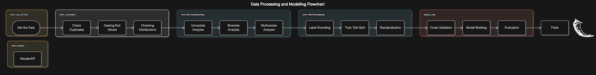

# Food Delivery Time Prediction



[Food Delivery App](https://food-delivery-app-2-324g.onrender.com/)

## Project Overview
This project focuses on developing a food delivery time prediction model. The primary goal is to accurately estimate the time it takes for food to be delivered to customers. By providing precise delivery time predictions, food delivery platforms can:
- Enhance customer experience
- Optimize delivery logistics
- Improve overall operational efficiency

## Data Source
The dataset used for this project contains detailed information such as:
- **Order Details**: Order time, order type, etc.
- **Location**: Pickup and delivery locations.
- **City Details**: Urban or suburban areas.
- **Delivery Personnel Information**: Experience, ratings, and delivery history.
- **Weather Conditions**: Rain, temperature, etc.
- **Actual Delivery Times**: Recorded times for analysis and validation.

## Technologies Used
- **Python** for implementation
- **Jupyter Notebook** for analysis and model development
- **Flask** for building the web application
- **Render API** for deploying the application

## Python Packages Used
- **Pandas** and **NumPy** for data manipulation
- **Scikit-learn** for model training and evaluation
- **Matplotlib** and **Seaborn** for data visualization
- **XGBoost** for building the best-performing model

## Steps Followed
### Data Collection
- Gathered the food delivery dataset from the provided data source.

### Data Preprocessing
- **Data Cleaning**: Handled missing values, outliers, and inconsistencies.
- **Feature Engineering**: Extracted and transformed relevant features for the prediction model.

### Model Development
- **Algorithms Explored**: 
  - Linear Regression
  - Decision Trees
  - Random Forest
  - XGBoost
- The **XGBoost model** was identified as the best-performing model.

### Model Evaluation
- Evaluated the performance of the models using the following metrics:
  - **Mean Squared Error (MSE)**
  - **Root Mean Squared Error (RMSE)**
  - **R-squared (R²)** Score

### Deployment
- The final model was deployed as a **Flask application** on **Render API** to provide real-time delivery time predictions.

## Results and Evaluation Criteria
- **Best Model**: **XGBoost**
- **R-squared (R²)** Score: **0.82**

## Future Improvements
1. **Feature Expansion**: Include additional features such as delivery partner characteristics and traffic patterns.
2. **Comprehensive Data Analysis**: Perform deeper exploratory analysis to uncover new insights and correlations.
3. **Model Optimization**: Fine-tune hyperparameters to further improve model accuracy.

## Installation and Setup
1. Clone the repository:
   ```bash
   git clone <repository-url>
   
